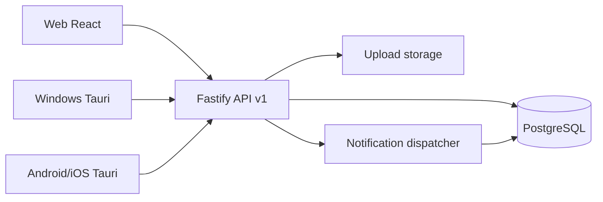

# WorkFlow Management System - Kiến trúc

## 0. Theo dõi tiến độ và trạng thái hoàn thành

Trạng thái triển khai chi tiết được theo dõi tại [`CHECKLIST.md`](CHECKLIST.md). Mỗi lần sửa code, migration, seed, tài liệu, Docker hoặc UI phải cập nhật checklist trong cùng commit.

Quy ước trạng thái:

- `DONE`: đã triển khai và kiểm tra.
- `PARTIAL`: đã có một phần chạy được nhưng còn thiếu chức năng, QA, test hoặc tài liệu.
- `TODO`: chưa triển khai.
- `WAITING`: chờ môi trường, chứng chỉ, thiết bị hoặc cấu hình bên ngoài.
- `BLOCKED`: đang bị chặn bởi lỗi hoặc điều kiện không thể tự xử lý.

## 1. Công nghệ được chọn và lý do

Repository ban đầu trống, vì vậy hệ thống được khởi tạo mới theo hướng **modular monolith**.

- **Backend API:** Node.js, TypeScript, Fastify, Prisma ORM.
  - Fastify nhẹ, ổn định, dễ mở rộng plugin, phù hợp API nội bộ hiệu năng tốt.
  - TypeScript giúp kiểm soát contract và giảm lỗi khi hệ thống nghiệp vụ lớn.
  - Prisma hỗ trợ migration, seed, type-safe query và PostgreSQL tốt.
- **Database:** PostgreSQL.
  - Phù hợp dữ liệu quan hệ, transaction, khóa ngoại, index, JSONB cho biểu mẫu động.
- **Frontend Web:** React, Vite, TypeScript.
  - Build nhanh, dễ bảo trì, phù hợp dashboard quản trị nội bộ.
  - UI viết tiếng Việt, responsive theo desktop/tablet/mobile.
- **Đa nền tảng:** React responsive + Tauri v2 shell cho Windows, Android, iOS.
  - Một codebase giao diện dùng chung cho web, PC và mobile, gọi cùng backend API.
  - Tauri chỉ cung cấp lớp native mỏng: secure storage, notification, file/camera integration và auto-update. Nghiệp vụ không nằm trong shell.
  - Không dùng WebView đơn giản kiểu đóng gói nguyên website: giao diện đã có responsive layout, bottom navigation trên mobile, API client, xử lý mạng yếu, upload và trạng thái đồng bộ ở tầng client.
- **Validation:** Zod ở backend; frontend hiển thị lỗi trả về theo cấu trúc thống nhất.
- **Auth:** JWT access token ngắn hạn + refresh token lưu hashed trong database, hỗ trợ thu hồi phiên.
- **Tài liệu API:** OpenAPI/Swagger tại `/docs`.
- **Kiểm thử:** Vitest cho domain/service quan trọng.
- **Triển khai:** Docker Compose gồm API, web và PostgreSQL.

Giả định triển khai:

- Phiên bản đầu dùng lưu file local trong thư mục upload, có service tách biệt để sau này chuyển S3/MinIO.
- Push notification có bảng đăng ký thiết bị và notification dispatcher nội bộ; adapter FCM/APNs/Desktop được để cấu hình thật nhưng không commit secret.
- Email/Telegram chưa bật ở phiên bản đầu, nhưng event notification đã tách để mở rộng.
- Offline không đồng bộ toàn hệ thống; client lưu bản nháp an toàn, retry cho thao tác idempotent, không retry tự động hành động phê duyệt.

## 2. Kiến trúc tổng thể

Backend dùng modular monolith:

- `auth`: đăng nhập, refresh token, phiên thiết bị, rate limit.
- `identity`: users, departments, teams, roles, permissions.
- `tasks`: công việc thường, progress, đánh giá, comment, attachment.
- `workflows`: mẫu quy trình, version, form schema, step, transition, approval.
- `notifications`: event nội bộ, inbox, device registration.
- `dashboard`: số liệu theo quyền người dùng.
- `audit`: nhật ký hoạt động.
- `settings`: cấu hình hệ thống.

Controller chỉ nhận request/response. Nghiệp vụ nằm trong service/use-case. Prisma là tầng data access. Policy kiểm tra quyền nằm ở backend.

## 3. Danh sách module

### Module nền tảng

- Đăng nhập, refresh token, đăng xuất, đăng xuất toàn bộ thiết bị.
- Người dùng, phòng ban, nhóm, chức danh, quản lý trực tiếp.
- RBAC: roles, permissions, role_permissions, user_roles.
- Notification center và device tokens.
- Audit log.
- Cấu hình hệ thống.
- Dashboard và báo cáo cơ bản.

### Quản lý công việc thường

- Tạo công việc, giao việc, người quản lý, người theo dõi.
- Công việc cha/con, phụ thuộc/liên quan, chống vòng lặp.
- Trạng thái, tiến độ, lịch sử tiến độ.
- Đánh giá kết quả, yêu cầu làm lại.
- Comment, reply, mention, attachment.
- List, Kanban, Calendar, My Tasks.
- Server-side filter, pagination, sort.

### Quy trình phê duyệt

- Workflow template và version.
- Form designer bằng schema JSONB + bảng field để truy vấn/version.
- Step designer, assignee resolver.
- Sequential/parallel approval.
- Transition condition builder an toàn, không dùng `eval`.
- Instance, values, current step, history approval.
- Idempotency key cho submit/approval.

## 4. Mô hình database

Các nhóm bảng chính:

- `users`, `departments`, `teams`, `team_members`, `roles`, `permissions`, `role_permissions`, `user_roles`, `refresh_tokens`, `device_tokens`.
- `task_categories`, `tags`, `tasks`, `task_assignees`, `task_followers`, `task_dependencies`, `task_comments`, `task_attachments`, `task_progress_logs`, `task_evaluations`, `task_status_logs`.
- `workflow_templates`, `workflow_versions`, `workflow_form_fields`, `workflow_steps`, `workflow_step_assignees`, `workflow_transitions`, `workflow_conditions`.
- `workflow_instances`, `workflow_instance_values`, `workflow_instance_steps`, `workflow_approvals`.
- `notifications`, `activity_logs`, `system_settings`, `idempotency_keys`.

Chuẩn hóa và ràng buộc:

- Khóa ngoại cho quan hệ chính.
- Unique constraint cho mã nhân viên, email, mã công việc, mã workflow.
- Index cho danh sách task theo status, due_date, department, creator, manager.
- Index cho hồ sơ workflow theo status, requester, current_step và assignee pending.
- Soft delete bằng `deleted_at` ở dữ liệu cần khôi phục.
- Optimistic locking bằng `version` cho `tasks`, `workflow_versions`, `workflow_instances`.
- Transaction cho tạo task, submit instance, approve/reject/request-info/return-step.

## 5. Cách phân quyền

RBAC không hard-code theo tên vai trò. Backend kiểm tra permission code như:

- `user.read`, `user.manage`
- `department.manage`
- `role.manage`
- `task.create`, `task.read_all`, `task.update_any`, `task.assign`, `task.evaluate`, `task.comment`
- `workflow.template.manage`, `workflow.instance.create`, `workflow.instance.approve`, `workflow.instance.read_all`
- `notification.read`, `audit.read`, `setting.manage`

Scope dữ liệu:

- Admin có permission toàn hệ thống.
- Manager xem dữ liệu của nhân viên trực thuộc qua `manager_id` và phòng ban phụ trách nếu được cấp quyền.
- Employee xem task/hồ sơ do mình tạo, được giao, quản lý, theo dõi hoặc chờ xử lý.
- Watcher chỉ được đọc/comment nếu policy cho phép.

Mọi policy chạy ở backend; frontend chỉ dùng quyền để điều chỉnh trải nghiệm.

## 6. Luồng xử lý công việc thường

1. Người dùng gửi form tạo task.
2. API validate dữ liệu, ngày, người tham gia, file, custom fields.
3. Service sinh mã task theo cấu hình `TASK-YYYYMMDD-XXXX`.
4. Transaction tạo `tasks`, assignees, followers, tags, attachments.
5. Ghi `activity_logs` và notification cho người thực hiện/theo dõi.
6. Người thực hiện cập nhật progress 0-100, mỗi lần ghi `task_progress_logs`.
7. Nếu progress = 100:
   - Task cần đánh giá: chuyển `PENDING_REVIEW`.
   - Không cần đánh giá: chuyển `DONE`.
8. Người tạo hoặc manager đánh giá:
   - Xác nhận: task `DONE`, lưu rating/comment/attachment.
   - Yêu cầu làm lại: task `IN_PROGRESS`, gửi notification.
9. Trạng thái quá hạn được tính động khi `due_date < now` và trạng thái chưa kết thúc.

## 7. Luồng xử lý quy trình phê duyệt

1. Quản trị viên tạo template và version nháp.
2. Cấu hình form fields, steps, assignees, transitions và structured conditions.
3. Khi active version đã có hồ sơ phát sinh, mọi thay đổi cấu trúc tạo version mới.
4. Người dùng tạo hồ sơ từ active version, API validate form schema.
5. Submit tạo `workflow_instances`, `workflow_instance_values`, step đầu tiên và pending approvals.
6. Người xử lý thao tác approve/reject/request-info/return/forward với idempotency key.
7. Service khóa transaction, kiểm tra quyền, kiểm tra approval chưa xử lý.
8. Tính điều kiện hoàn thành step:
   - Sequential: mở người tiếp theo sau khi người hiện tại duyệt.
   - Parallel: all/any/min_count/min_percent.
9. Tính transition theo conditions AND/OR an toàn từ JSONB, không thực thi code.
10. Cập nhật current step, history, notification. Nếu đến end step thì instance `APPROVED` hoặc `COMPLETED`.

## 8. Kế hoạch triển khai theo từng giai đoạn

### Giai đoạn 1 - Nền tảng chạy được

- Khởi tạo monorepo.
- API auth/RBAC/users/departments.
- Prisma schema, migration, seed.
- Web login, dashboard, sidebar, notification center.
- Docker Compose PostgreSQL/API/Web.

### Giai đoạn 2 - Công việc thường

- CRUD task, assignment, follower, tag/category.
- Progress, evaluation, redo, overdue computed.
- List/Kanban/Calendar/My Tasks.
- Comment, attachment, audit log.

### Giai đoạn 3 - Quy trình phê duyệt

- Template/version/form/step designer.
- Instance submit, sequential approval, parallel approval.
- Reject, request-info, return-step, idempotency, history.
- Branching condition builder.

### Giai đoạn 4 - Đa nền tảng

- Tauri Windows package.
- Tauri Android/iOS project setup.
- Secure token storage adapter.
- Native notification adapter và deep link.
- Camera/file picker integration.
- Offline draft queue cho thao tác an toàn.

Trạng thái build hiện tại:

- Windows desktop build đã tạo được `.exe`, `.msi` và NSIS setup bằng `pnpm --filter @workflow/web desktop:build`.
- Android Tauri project đã khởi tạo được bằng `tauri android init --ci`; môi trường Windows đã kiểm chứng với Rust, Android SDK Command-line Tools, Android NDK side-by-side và Rust Android targets.
- Android arm64 APK kiểm thử đã build được bằng `pnpm android:build:arm64`. Script này dùng workaround copy native library khi Windows chưa bật Developer Mode nên Tauri không tạo được symbolic link.
- iOS chưa build trên máy Windows. Lệnh iOS cần chạy trên macOS có Xcode, Apple signing assets và Tauri iOS subcommand.

### Giai đoạn 5 - Vận hành

- CI lint/type-check/test/build.
- Backup database/uploads.
- Production config, staging config.
- Monitoring health-check và audit review.

## 9. Bổ sung kiến trúc UI/UX, cấu hình và báo cáo

Yêu cầu cập nhật mở rộng phạm vi từ hệ thống nghiệp vụ chạy được sang sản phẩm quản trị nội bộ hoàn chỉnh. Các nhóm dưới đây được quản lý trong `CHECKLIST.md` và triển khai theo giai đoạn để không làm hỏng nền tảng đang chạy.

### 9.1. Design system và frontend structure

Trạng thái hiện tại: các nhóm trang nghiệp vụ chính đã được tách khỏi app shell: task pages ở `apps/web/src/pages/tasks.tsx`, workflow/approval pages ở `apps/web/src/pages/workflows.tsx`, admin/log/settings pages ở `apps/web/src/pages/admin.tsx`. `App.tsx` hiện giữ login, app shell, dashboard và router nội bộ; các lượt sau sẽ tiếp tục chuẩn hóa layout components và shared UI utilities.

Frontend hiện dùng React/Vite với CSS variables và các component nội bộ trong `App.tsx`. Giai đoạn tiếp theo cần tách thành cấu trúc:

- `src/components/layout`: sidebar, topbar, breadcrumb, bottom navigation.
- `src/components/ui`: button, input, select, textarea, table, mobile card, modal, sheet, status chip, file picker, empty/error/loading/skeleton.
- `src/features/tasks`: list, filters, form, detail, kanban, calendar, progress, evaluation, comments, attachments.
- `src/features/workflows`: templates, form builder, workflow designer, instances, approvals, history.
- `src/features/admin`: users, departments, org chart, roles, permission matrix, settings, shared categories.
- `src/features/reports`: task reports, workflow reports, drill-down, export jobs.
- `src/api`: API client, auth refresh, upload/download, error mapping.

Design system cần tài liệu hóa token màu, typography, spacing, status colors, light/dark mode, focus states và responsive rules. Data table trên desktop phải chuyển thành mobile cards; filter nâng cao trên mobile dùng bottom sheet hoặc full-screen filter.

### 9.2. Trình thiết kế quy trình trực quan

Workflow designer sẽ là module UI riêng, không thay đổi mô hình backend hiện có. Backend tiếp tục lưu version, steps, assignees, transitions và conditions có cấu trúc. UI cần thêm:

- Canvas kéo thả node.
- Node start, form, handler, approval, condition, parallel approval, notification, wait, create task, end.
- Panel cấu hình node và đường nối.
- Condition builder dùng field/operator/value/group, không `eval`.
- Validate workflow trước khi publish.
- Preview và compare versions.

Trong phiên bản đầu tiên của designer, dữ liệu lưu vẫn map về các bảng `workflow_steps`, `workflow_step_assignees`, `workflow_transitions`, `workflow_conditions`.

### 9.3. Form builder kéo thả

Form builder sẽ dùng cùng `workflow_form_fields` và `workflow_versions.form_schema`. Các khả năng cần mở rộng:

- Layout trái/giữa/phải cho field palette, canvas và property panel.
- Section, tab, grid, repeating table.
- Field condition, calculated field, validation, default value.
- Field permission theo role và theo step.
- Preview PC/mobile.

Backend validate form theo version đang active để hồ sơ cũ tiếp tục chạy đúng schema cũ.

### 9.4. Cấu hình hệ thống và danh mục dùng chung

`system_settings` hiện là key/value. Cần mở rộng UI theo nhóm:

- Cấu hình chung.
- Mã tự động.
- Công việc.
- Quy trình.
- Ngày làm việc, ngày nghỉ, SLA.
- Tệp upload.
- Thông báo, email, push.
- Bảo mật.
- Dữ liệu và sao lưu.

Danh mục dùng chung cần module riêng để quản trị các danh mục tùy chỉnh, có thể làm nguồn dữ liệu cho field select trong form builder.

### 9.5. Tổ chức, người dùng và phân quyền nâng cao

RBAC hiện có roles/permissions cơ bản. Giai đoạn tiếp theo cần:

- Org chart dạng tree, list và sơ đồ tổ chức.
- User profile gồm thiết bị đăng nhập, hoạt động gần đây, task/workflow liên quan.
- Import user từ CSV/Excel có preview và lỗi từng dòng.
- Permission matrix dạng module x action.
- Data scope theo quyền.
- Field-level permission.
- Preview quyền theo user/role.
- Cảnh báo xung đột quyền và bảo vệ admin cuối cùng.

Policy vẫn phải thực thi ở backend và áp vào database query, không chỉ ẩn UI.

### 9.6. Báo cáo và phân tích

Dashboard hiện là báo cáo cơ bản. Module report riêng cần:

- Báo cáo công việc theo trạng thái, phòng ban, assignee, assigner, priority, overdue, redo, completion rate, average completion time.
- Báo cáo quy trình theo trạng thái, template, department, requester, pending, overdue, average processing time, bottleneck step, approval/reject rate.
- Filter theo thời gian, chi nhánh, phòng ban, nhóm, user, workflow, status, priority, category, tag.
- Drill-down từ chart/metric về danh sách dữ liệu.
- Export Excel/CSV/PDF/print theo quyền, có audit log và giới hạn hệ thống.

### 9.7. Mobile, accessibility và hiệu năng

Mobile web/Tauri không được là bản PC thu nhỏ. Cần tiếp tục:

- Bottom navigation theo nhóm Tổng quan, Công việc, Phê duyệt, Thông báo, Cá nhân.
- Detail task/workflow chia section/tab.
- Approval mobile có action rõ, nút không quá gần, có xác nhận và lý do.
- Camera/file picker native, preview, compression, upload progress, cancel, retry.
- Keyboard navigation, focus state, tooltip, label, ARIA cơ bản.
- Debounce search, lazy load tabs, cache danh mục, skeleton loading.
- Workflow designer phải hướng đến 100 node mượt.

### 9.8. Kế hoạch kiểm thử mở rộng

Đã có Playwright smoke suite cho web tại `apps/web/e2e/workflow-smoke.spec.ts`, chạy bằng `pnpm smoke:web` khi Docker API/web đang bật. Suite hiện phủ login, mở task vừa tạo, upload/download attachment, cập nhật progress lên chờ đánh giá, approve/reject/request-info hồ sơ PAYMENT và idempotency key chống duyệt trùng. GitHub Actions chạy `verify` và `smoke-web` trên `push`/`pull_request`.

Ngoài Vitest hiện có, cần thêm UI/e2e suite:

- Login, refresh token, logout.
- Task create/progress/evaluate/comment/upload/download.
- Workflow submit/approve/reject/request info/return/idempotency.
- Permission visibility và backend denial.
- Form validation, draft restore, dark mode, offline state.
- Responsive ở phone nhỏ, phone lớn, tablet, laptop, desktop.
- Browser matrix Chrome/Edge; Android/iOS/Windows desktop khi có môi trường phù hợp.
