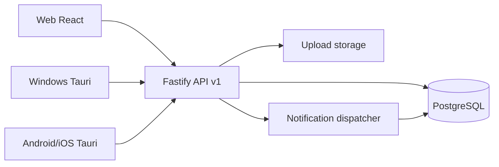

# WorkFlow Management System - Kiến trúc

## 1. Công nghệ được chọn và lý do

Repository ban đầu trống, vì vậy hệ thống được khởi tạo mới theo hướng **modular monolith**.

- **Backend API:** Node.js, TypeScript, Fastify, Prisma ORM.
  - Fastify nhẹ, ổn định, dễ mở rộng plugin, phù hợp API nội bộ hiệu năng tốt.
  - TypeScript giúp kiểm soát contract và giảm lỗi khi hệ thống nghiệp vụ lớn.
  - Prisma hỗ trợ migration, seed, type-safe query và PostgreSQL tốt.
- **Database:** PostgreSQL.
  - Phù hợp dữ liệu quan hệ, transaction, khóa ngoại, index, JSONB cho biểu mẫu động.
- **Frontend Web:** React, Vite, TypeScript.
  - Build nhanh, dễ bảo trì, phù hợp dashboard quản trị nội bộ.
  - UI viết tiếng Việt, responsive theo desktop/tablet/mobile.
- **Đa nền tảng:** React responsive + Tauri v2 shell cho Windows, Android, iOS.
  - Một codebase giao diện dùng chung cho web, PC và mobile, gọi cùng backend API.
  - Tauri chỉ cung cấp lớp native mỏng: secure storage, notification, file/camera integration và auto-update. Nghiệp vụ không nằm trong shell.
  - Không dùng WebView đơn giản kiểu đóng gói nguyên website: giao diện đã có responsive layout, bottom navigation trên mobile, API client, xử lý mạng yếu, upload và trạng thái đồng bộ ở tầng client.
- **Validation:** Zod ở backend; frontend hiển thị lỗi trả về theo cấu trúc thống nhất.
- **Auth:** JWT access token ngắn hạn + refresh token lưu hashed trong database, hỗ trợ thu hồi phiên.
- **Tài liệu API:** OpenAPI/Swagger tại `/docs`.
- **Kiểm thử:** Vitest cho domain/service quan trọng.
- **Triển khai:** Docker Compose gồm API, web và PostgreSQL.

Giả định triển khai:

- Phiên bản đầu dùng lưu file local trong thư mục upload, có service tách biệt để sau này chuyển S3/MinIO.
- Push notification có bảng đăng ký thiết bị và notification dispatcher nội bộ; adapter FCM/APNs/Desktop được để cấu hình thật nhưng không commit secret.
- Email/Telegram chưa bật ở phiên bản đầu, nhưng event notification đã tách để mở rộng.
- Offline không đồng bộ toàn hệ thống; client lưu bản nháp an toàn, retry cho thao tác idempotent, không retry tự động hành động phê duyệt.

## 2. Kiến trúc tổng thể

Backend dùng modular monolith:

- `auth`: đăng nhập, refresh token, phiên thiết bị, rate limit.
- `identity`: users, departments, teams, roles, permissions.
- `tasks`: công việc thường, progress, đánh giá, comment, attachment.
- `workflows`: mẫu quy trình, version, form schema, step, transition, approval.
- `notifications`: event nội bộ, inbox, device registration.
- `dashboard`: số liệu theo quyền người dùng.
- `audit`: nhật ký hoạt động.
- `settings`: cấu hình hệ thống.

Controller chỉ nhận request/response. Nghiệp vụ nằm trong service/use-case. Prisma là tầng data access. Policy kiểm tra quyền nằm ở backend.

## 3. Danh sách module

### Module nền tảng

- Đăng nhập, refresh token, đăng xuất, đăng xuất toàn bộ thiết bị.
- Người dùng, phòng ban, nhóm, chức danh, quản lý trực tiếp.
- RBAC: roles, permissions, role_permissions, user_roles.
- Notification center và device tokens.
- Audit log.
- Cấu hình hệ thống.
- Dashboard và báo cáo cơ bản.

### Quản lý công việc thường

- Tạo công việc, giao việc, người quản lý, người theo dõi.
- Công việc cha/con, phụ thuộc/liên quan, chống vòng lặp.
- Trạng thái, tiến độ, lịch sử tiến độ.
- Đánh giá kết quả, yêu cầu làm lại.
- Comment, reply, mention, attachment.
- List, Kanban, Calendar, My Tasks.
- Server-side filter, pagination, sort.

### Quy trình phê duyệt

- Workflow template và version.
- Form designer bằng schema JSONB + bảng field để truy vấn/version.
- Step designer, assignee resolver.
- Sequential/parallel approval.
- Transition condition builder an toàn, không dùng `eval`.
- Instance, values, current step, history approval.
- Idempotency key cho submit/approval.

## 4. Mô hình database

Các nhóm bảng chính:

- `users`, `departments`, `teams`, `team_members`, `roles`, `permissions`, `role_permissions`, `user_roles`, `refresh_tokens`, `device_tokens`.
- `task_categories`, `tags`, `tasks`, `task_assignees`, `task_followers`, `task_dependencies`, `task_comments`, `task_attachments`, `task_progress_logs`, `task_evaluations`, `task_status_logs`.
- `workflow_templates`, `workflow_versions`, `workflow_form_fields`, `workflow_steps`, `workflow_step_assignees`, `workflow_transitions`, `workflow_conditions`.
- `workflow_instances`, `workflow_instance_values`, `workflow_instance_steps`, `workflow_approvals`.
- `notifications`, `activity_logs`, `system_settings`, `idempotency_keys`.

Chuẩn hóa và ràng buộc:

- Khóa ngoại cho quan hệ chính.
- Unique constraint cho mã nhân viên, email, mã công việc, mã workflow.
- Index cho danh sách task theo status, due_date, department, creator, manager.
- Index cho hồ sơ workflow theo status, requester, current_step và assignee pending.
- Soft delete bằng `deleted_at` ở dữ liệu cần khôi phục.
- Optimistic locking bằng `version` cho `tasks`, `workflow_versions`, `workflow_instances`.
- Transaction cho tạo task, submit instance, approve/reject/request-info/return-step.

## 5. Cách phân quyền

RBAC không hard-code theo tên vai trò. Backend kiểm tra permission code như:

- `user.read`, `user.manage`
- `department.manage`
- `role.manage`
- `task.create`, `task.read_all`, `task.update_any`, `task.assign`, `task.evaluate`, `task.comment`
- `workflow.template.manage`, `workflow.instance.create`, `workflow.instance.approve`, `workflow.instance.read_all`
- `notification.read`, `audit.read`, `setting.manage`

Scope dữ liệu:

- Admin có permission toàn hệ thống.
- Manager xem dữ liệu của nhân viên trực thuộc qua `manager_id` và phòng ban phụ trách nếu được cấp quyền.
- Employee xem task/hồ sơ do mình tạo, được giao, quản lý, theo dõi hoặc chờ xử lý.
- Watcher chỉ được đọc/comment nếu policy cho phép.

Mọi policy chạy ở backend; frontend chỉ dùng quyền để điều chỉnh trải nghiệm.

## 6. Luồng xử lý công việc thường

1. Người dùng gửi form tạo task.
2. API validate dữ liệu, ngày, người tham gia, file, custom fields.
3. Service sinh mã task theo cấu hình `TASK-YYYYMMDD-XXXX`.
4. Transaction tạo `tasks`, assignees, followers, tags, attachments.
5. Ghi `activity_logs` và notification cho người thực hiện/theo dõi.
6. Người thực hiện cập nhật progress 0-100, mỗi lần ghi `task_progress_logs`.
7. Nếu progress = 100:
   - Task cần đánh giá: chuyển `PENDING_REVIEW`.
   - Không cần đánh giá: chuyển `DONE`.
8. Người tạo hoặc manager đánh giá:
   - Xác nhận: task `DONE`, lưu rating/comment/attachment.
   - Yêu cầu làm lại: task `IN_PROGRESS`, gửi notification.
9. Trạng thái quá hạn được tính động khi `due_date < now` và trạng thái chưa kết thúc.

## 7. Luồng xử lý quy trình phê duyệt

1. Quản trị viên tạo template và version nháp.
2. Cấu hình form fields, steps, assignees, transitions và structured conditions.
3. Khi active version đã có hồ sơ phát sinh, mọi thay đổi cấu trúc tạo version mới.
4. Người dùng tạo hồ sơ từ active version, API validate form schema.
5. Submit tạo `workflow_instances`, `workflow_instance_values`, step đầu tiên và pending approvals.
6. Người xử lý thao tác approve/reject/request-info/return/forward với idempotency key.
7. Service khóa transaction, kiểm tra quyền, kiểm tra approval chưa xử lý.
8. Tính điều kiện hoàn thành step:
   - Sequential: mở người tiếp theo sau khi người hiện tại duyệt.
   - Parallel: all/any/min_count/min_percent.
9. Tính transition theo conditions AND/OR an toàn từ JSONB, không thực thi code.
10. Cập nhật current step, history, notification. Nếu đến end step thì instance `APPROVED` hoặc `COMPLETED`.

## 8. Kế hoạch triển khai theo từng giai đoạn

### Giai đoạn 1 - Nền tảng chạy được

- Khởi tạo monorepo.
- API auth/RBAC/users/departments.
- Prisma schema, migration, seed.
- Web login, dashboard, sidebar, notification center.
- Docker Compose PostgreSQL/API/Web.

### Giai đoạn 2 - Công việc thường

- CRUD task, assignment, follower, tag/category.
- Progress, evaluation, redo, overdue computed.
- List/Kanban/Calendar/My Tasks.
- Comment, attachment, audit log.

### Giai đoạn 3 - Quy trình phê duyệt

- Template/version/form/step designer.
- Instance submit, sequential approval, parallel approval.
- Reject, request-info, return-step, idempotency, history.
- Branching condition builder.

### Giai đoạn 4 - Đa nền tảng

- Tauri Windows package.
- Tauri Android/iOS project setup.
- Secure token storage adapter.
- Native notification adapter và deep link.
- Camera/file picker integration.
- Offline draft queue cho thao tác an toàn.

### Giai đoạn 5 - Vận hành

- CI lint/type-check/test/build.
- Backup database/uploads.
- Production config, staging config.
- Monitoring health-check và audit review.

